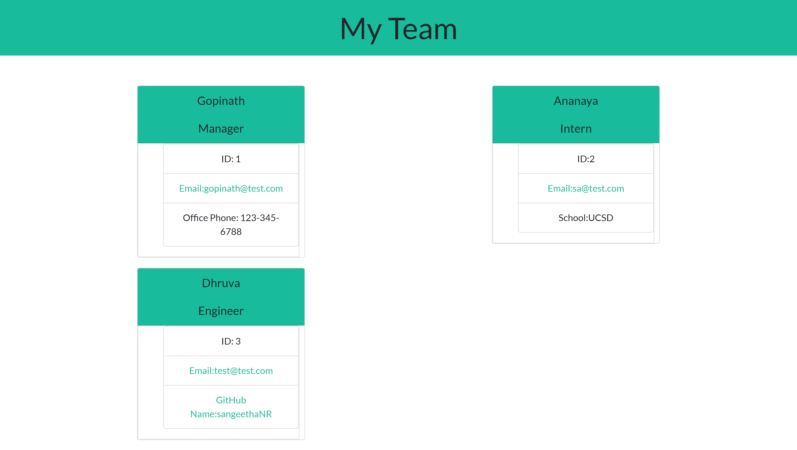

# Team-Profile-Generator

 ## Description
 In this project,takes in information about employees on a software engineering team, then generates an HTML webpage that displays summaries for each person. Testing is key to making code maintainable,this project includes TDD for all the class.
  The ScreenShot of the app given below
 
  ## Technologies Used
 node.js
Bootstrap

## Features
 ```
 GIVEN a command-line application that accepts user input
WHEN I am prompted for my team members and their information
THEN an HTML file is generated that displays a nicely formatted team roster based on user input
WHEN I click on an email address in the HTML
THEN my default email program opens and populates the TO field of the email with the address
WHEN I click on the GitHub username
THEN that GitHub profile opens in a new tab
WHEN I start the application
THEN I am prompted to enter the team manager’s name, employee ID, email address, and office number
WHEN I enter the team manager’s name, employee ID, email address, and office number
THEN I am presented with a menu with the option to add an engineer or an intern or to finish building my team
WHEN I select the engineer option
THEN I am prompted to enter the engineer’s name, ID, email, and GitHub username, and I am taken back to the menu
WHEN I select the intern option
THEN I am prompted to enter the intern’s name, ID, email, and school, and I am taken back to the menu
WHEN I decide to finish building my team
THEN I exit the application, and the HTML is generated
```


## Installation 💾
On GitHub, navigate to the main page of the repository. To clone the repository using HTTPS, under "Clone with HTTPS", click . To clone the repository using an SSH key, including a certificate issued by your organization's SSH certificate authority, click Use SSH, then click clipboard image . To clone a repository using GitHub CLI, click Use GitHub CLI, then click clipboard image .

open Git Bash

Change the current working directory to the location where you want the cloned directory.

Type git clone, and then paste the SSH you copied earlier.

$ git clone git@github.com:sangeethaNR/Team-Profile-Generator.git Press Enter to create your local clone.


Cloning into Spoon-Knife... remote: Counting objects: 10, done. remote: Compressing objects: 100% (8/8), done. remove: Total 10 (delta 1), reused 10 (delta 1) Unpacking objects: 100% (10/10), done.

You installed the project to your local!!!

Link to the deployed application https://github.com/sangeethaNR/Team-Profile-Generator.git
 
 Upon Installation to run this app

 Open integrated Terminal 
 
 <b> npm init i </b>

It will install inquirer as the app has its dependency.

 To make use this app

 use <b>node index.js </b>


## Credits
  Github 
  Google

  ## Questions
   ✉️ Contact me with any questions: <a href="mailto:sangeethajadhav123@gmail.com">email</a> , <a href="https://github.com/sangeethaNR">GitHub</a>